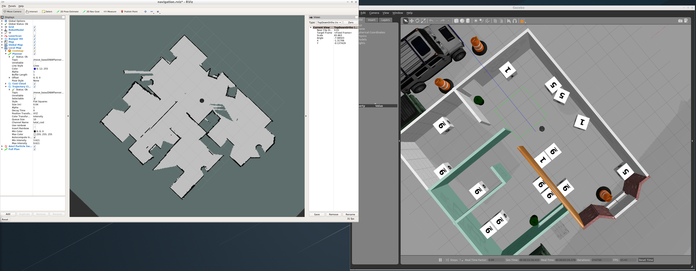

# Home Service Robot


](final_results.gif)

YouTube Link: https://youtu.be/yLND5wDFcBc

## Requirements:
In order to make sure that all the required packages are installed, I used this command:
```
sudo apt install ros-kinetic-turtlebot-*
```

To build the project:
```
cd catkin_ws_home_service_robot
catkin_make
source devel/setup.sh
```

### Files:

```
    ├──                                # Official ROS packages
    |
    ├── slam_gmapping                  # gmapping_demo.launch file                   
    │   ├── gmapping
    │   ├── ...
    ├── turtlebot                      # keyboard_teleop.launch file
    │   ├── turtlebot_teleop
    │   ├── ...
    ├── turtlebot_interactions         # view_navigation.launch file      
    │   ├── turtlebot_rviz_launchers
    │   ├── ...
    ├── turtlebot_simulator            # turtlebot_world.launch file 
    │   ├── turtlebot_gazebo
    │   ├── ...
    |
    ├── integration                    # my launch and world files to use above packages
    │   ├── launch
    │   ├── worlds
    |
    ├── maps                           # map files
    │   ├── ...
    ├── scripts                        # shell scripts files
    │   ├── ...
    ├──rvizConfigs                     # rviz configuration files
    │   ├── ...
    ├──pick_objects                    # pick_objects C++ node
    │   ├── src/pick_objects_node.cpp
    │   ├── ...
    ├──add_markers                     # add_marker C++ node
    │   ├── src/add_markers_node.cpp
    │   ├── ...
    └──
```

### Used ROS Packages:

#### TurtleBot (Meta)Packages:
Different Turtlebot packages are being used to simulate and accomplish this project. Such as:
* Turtlebot stack: https://github.com/turtlebot/turtlebot
    * Including `turtlebot_teleop` package: http://wiki.ros.org/turtlebot_teleop
* `turtlebot_rviz_launchers`: http://wiki.ros.org/turtlebot_rviz_launchers
* `turtlebot_gazebo`: http://wiki.ros.org/turtlebot_gazebo

#### Gmapping
[Gmapping package](http://wiki.ros.org/gmapping) is used to create the map of the environment. The created maps can be found in the `maps` directory. The `src/maps/map3` was the best map that I could create. I tried mapping with different world models and parameters for gmapping package and `map3` was the best results.



In order to redo the mapping it is enough to do the following commands:
```
cd catkin_ws_home_service_robot/src/scripts
./test_slam.sh
```
Now choose the xterm that is running the `keyboard_teleop.launch` 
and navigate the robot manually to generate the map. 
`keyboard_teleop.launch` is part of `turtlebot_teleop` package. 
To learn more, please take a look at 
[here](http://wiki.ros.org/turtlebot_teleop).
When all parts of the map are covered, use the following command to save the map:
```
rosrun map_server map_saver -f outputFile
```

Adaptive Monte Carlo Localization (AMCL) is used for localization.

#### Localization and Navigation:
`test_navigation.sh` script is a demo of the navigation and localization. To run it:
```
cd catkin_ws_home_service_robot/src/scripts
./test_navigation.sh
```
This script is using ROS Navigation stack and Adaptive Monte Carlo 
Localization (AMCL) for localization under the hood which is being 
included in `catkin_ws_home_service_robot/src/integration/launch/amcl_demo.launch` file.
It is using Dijkstra's algorithm for navigation which is a variant of \
the Uniform Cost Search algorithm, while avoiding obstacles on its path.

After running the script, you can use rviz to set goal location and robot should 
move to that selected location like the animation below:


I used this method to get the coordinates of some target points for the delivery and pickup zones. 
It is enough to run the following command on a new terminal to echo the selected target locations 
on the terminal.

```
rostopic echo /move_base/goal 
```

I have chosen the following poses:
1. Pickup Zone
```
goal: 
  target_pose: 
    header: 
      frame_id: "map"
    pose: 
      position: 
        x: -5.68023967743
        y: 3.39695715904
        z: 0.0
      orientation: 
        x: 0.0
        y: 0.0
        z: -0.245873951689
        w: 0.969301810522
```
2. Delivery Zone
```
goal: 
  target_pose: 
    header: 
      frame_id: "map"
    pose: 
      position: 
        x: -4.27964115143
        y: -3.69061994553
        z: 0.0
      orientation: 
        x: 0.0
        y: 0.0
        z: 0.443500324123
        w: 0.896274211669
```

## Extra Learning Resources:
* http://wiki.ros.org/turtlebot/Tutorials/indigo