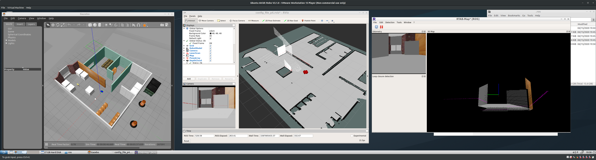
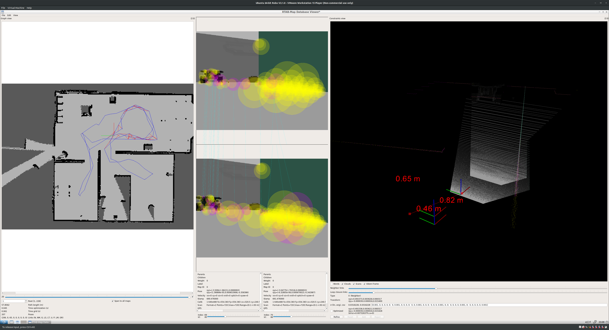

# Project 4: Map My World

* Add RGB-D Camera to previous robot simulation
* Write a launch file that runs SLAM algorithm
* Assign the correct topic to be remapped to the topics required by rtabmap.
    * scan
    * rgb/image
    * depth/image
    * rgb/camera_info
* Prepare the launch files to launch:
    * Gazebo and World and Spawn the robot
    * Rviz
    * Mapping Algorithm
    * Tele Operation Node

# Commands
```
sudo apt-get install ros-kinetic-rtabmap-ros

cd catkin_ws_p4
catkin_make -j8
source devel/setup.sh

roslaunch my_robot world_p4.launch
roslaunch project4 rviz.launch
roslaunch project4 teleop.launch

# For SLAM
roslaunch project4 mapping.launch

# For Localization Only (After SLAM is done)
roslaunch project4 localization.launch


# to view the database
rtabmap-databaseViewer ~/.ros/rtabmap.db
```
# Results:

The map could be easily build as the following image, but this map did not have enough feature to generate loop closure:




By adding more details to the map I could get 65 loop closure detections as the following image



# Map DataBase

The final Map database can be found at `rtabmap.db`.